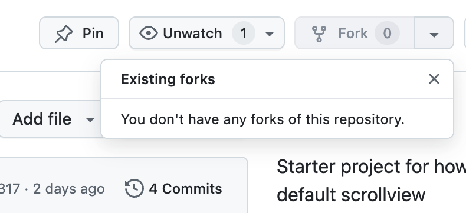
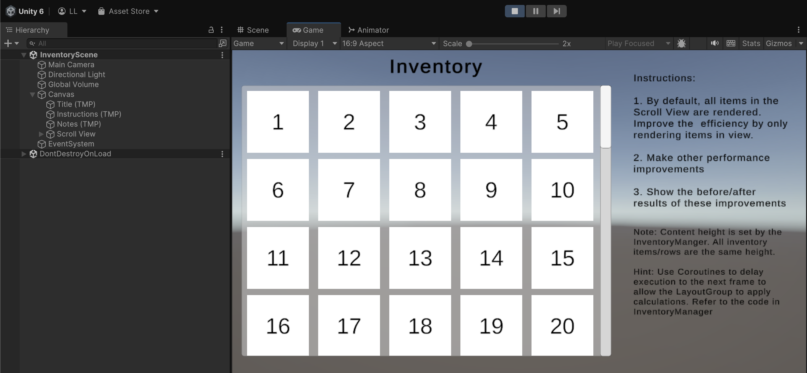

# unity-scrollview-test
Starter project for how to optimize the default scrollview

## Instructions

1. Fork this repo 

- Find the button in the top right
- You can use the default options (e.g. Main branch only)

2. Clone your own forked copy of the repo

- Using `git clone` will do. Git LFS is not needed.

3. Download and install Unity `6000.0.30f1` which is used for this project

- You can get the installer [here](http://unity.com/releases/editor/archive)

- If you have a newer version of Unity 6 that should work as well

4. Add the Unity project located in the `/Scroll View` folder

5. Open the `Scroll View` project. Further instructions will be in the project scene

- Entering Play mode, you should see the Scroll View populated with items like the image below

## Submitting your Solution

1. Once you have implemented your solution, share the link to your forked Github repo with your recruiter. Ensure that you have pushed your solution to your main branch.

Good Luck!